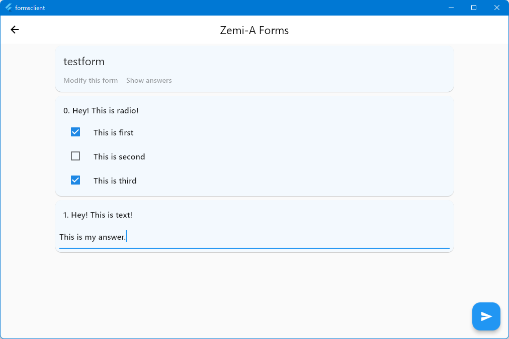

# formsclient


This is client software for a forms-like system written in [Flutter 3](https://flutter.dev/). The server is [here (private)](https://github.com/Pro-ktmr/forms-server).

For deployments, visit [Releases](https://github.com/watamario15/formsclient/releases) and the [web page](https://watamario15.github.io/formsclient).

The purpose of this project is to evaluate the pair-programming ([watamario15](https://github.com/watamario15), [Nishidaaaa](https://github.com/Nishidaaaa), [mittu205](https://github.com/mittu205)). **NOT FOR A PRACTICAL USE.**

## Features
Fetches a form from a server, displays it, users fill it, and users submit it to the server. That's it.

## Specs
Uses JSONs to communicate with a server. Samples follow.

A form to fetch:
```json
{
    "result": "ok",
    "id": "1",
    "form": {
        "id": "1",
        "title": "testform",
        "questions": [
            {
                "id": 0,
                "type": "radio",
                "explanation": "Hey! This is radio!",
                "selection": [
                    {
                        "label": 0,
                        "value": "This is first"
                    },
                    {
                        "label": 1,
                        "value": "This is second"
                    },
                    {
                        "label": 2,
                        "value": "This is third"
                    }
                ]
            },
            {
                "id": 1,
                "type": "text",
                "explanation": "Hey! This is text!"
            }
        ]
    }
}
```

An answer to submit:
```json
{
    "id": "1",
    "answers": [
        {
            "id": 0,
            "type": "radio",
            "value": {
                "0": false,
                "1": true,
                "2": true
            }
        },
        {
            "id": 1,
            "type": "text",
            "value": "This is my answer."
        }
    ]
}
```

Collected answers to receive from a server (not implemented)
```json
{
    "result": "ok",
    "id": "1",
    "answers": [
        {
            "id": "1",
            "answers": [
                {
                    "id": 0,
                    "type": "radio",
                    "value": {
                        "0": false,
                        "1": true,
                        "2": true
                    }
                },
                {
                    "id": 1,
                    "type": "text",
                    "value": "This is my answer."
                }
            ]
        },
        {
            "id": "1",
            "answers": [
                {
                    "id": 0,
                    "type": "radio",
                    "value": {
                        "0": true,
                        "1": false,
                        "2": true
                    }
                },
                {
                    "id": 1,
                    "type": "text",
                    "value": "This is my 2nd answer."
                }
            ]
        }
    ]
}
```
